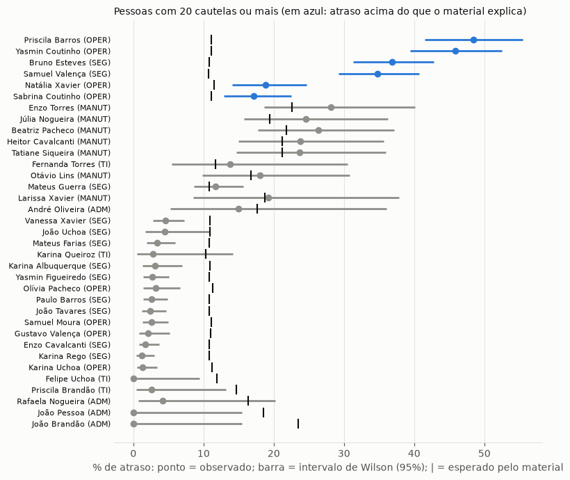
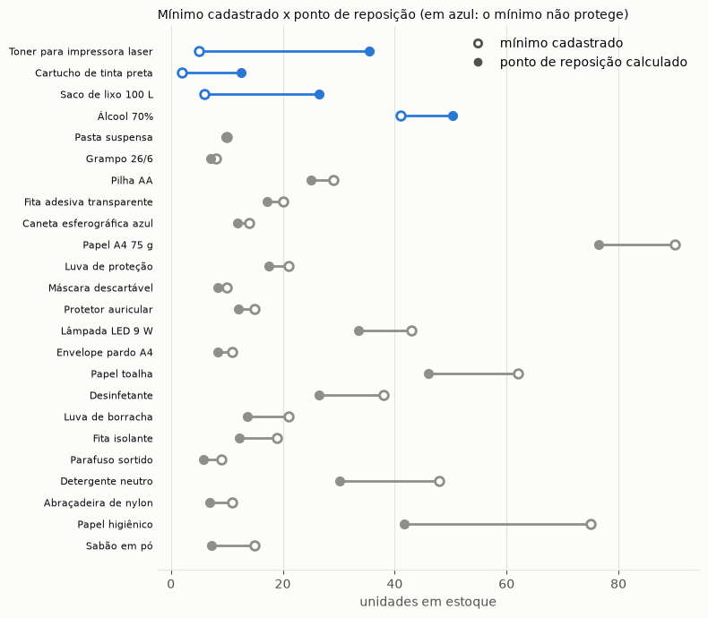
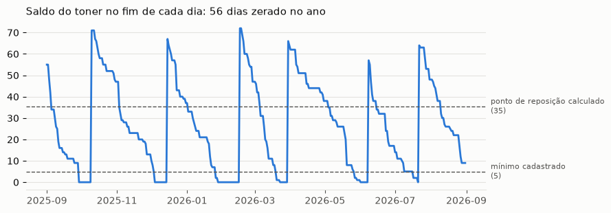
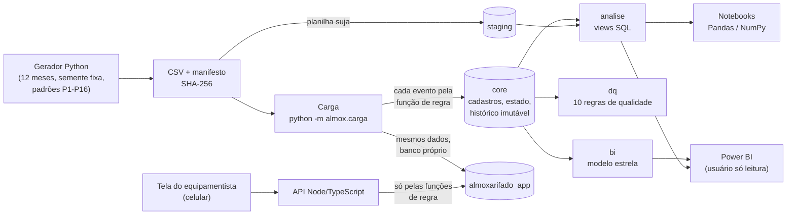
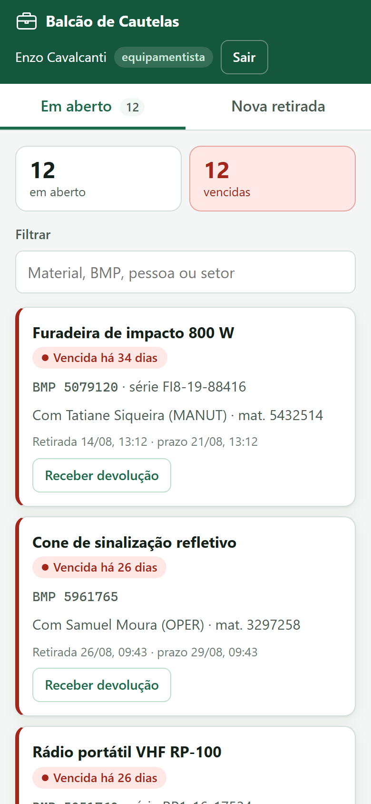
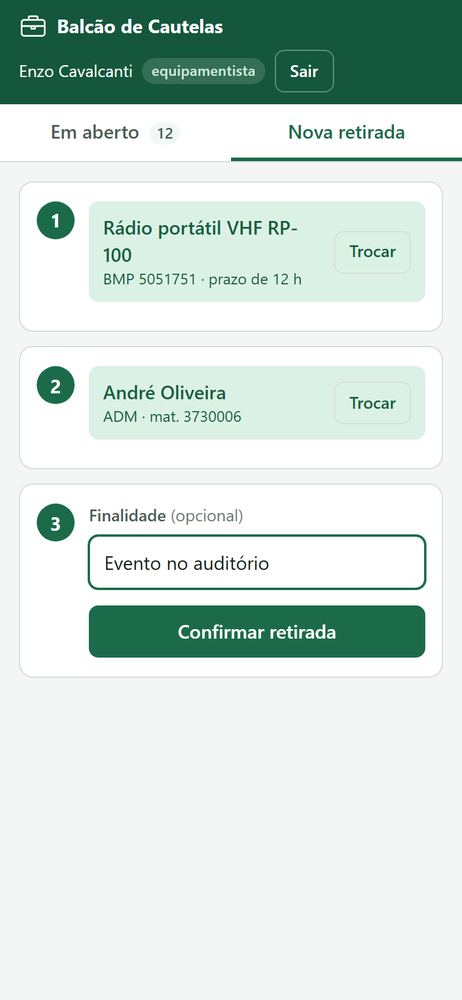
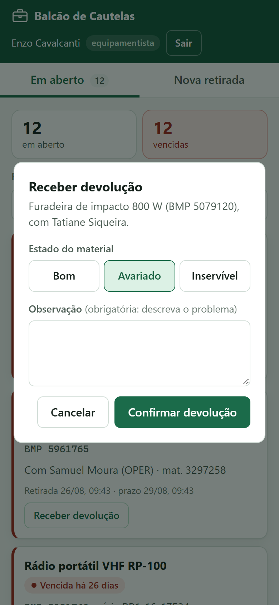
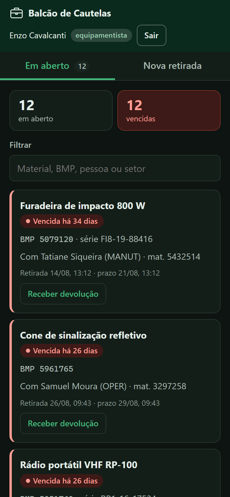

# Controle de Materiais e Cautela

**Análise de dados do controle de material de uma unidade logística (dados fictícios): carga patrimonial, cautelas, uso de equipamentos e estoque de consumo, com PostgreSQL, SQL analítico, Python (Pandas/NumPy) e Power BI. Mais uma tela de balcão, para celular, que registra retiradas e devoluções pelas mesmas regras do banco.**

> Projeto 2 do meu portfólio de Dados, na sequência do [Painel de Vendas](https://github.com/DiegoSantiago1/analise-vendas-concessionaria). Dados, análises e aplicação concluídos; o relatório Power BI é a próxima etapa.

## O problema

Trabalhei na Força Aérea Brasileira em funções administrativas, incluindo controle de materiais e conferência de carga patrimonial. Esse controle costuma viver em planilhas, e os problemas se repetem: o mesmo item escrito de vários jeitos, número de patrimônio em branco ou digitado errado, material que a planilha diz estar no depósito mas está emprestado com alguém, ferramenta que nunca volta no prazo, item de consumo que acaba antes da compra chegar.

Este projeto transforma essa rotina em quatro perguntas de negócio, respondidas com dados:

1. **Conferência:** onde a planilha de carga não bate com o cadastro, e onde os erros se concentram?
2. **Cautela:** quem está com cada material, quem atrasa a devolução, e o atraso é da pessoa ou do processo?
3. **Uso:** o que sobra, o que falta e o que se desgasta?
4. **Consumo:** que item vai faltar, e quais têm o estoque mínimo mal definido?

> **Todos os dados são fictícios**, gerados em Python. Nenhuma informação real (pessoas, unidades, locais, números de patrimônio) está neste repositório, e o projeto não inclui armamento nem material de armaria.

## Resultados

| # | Pergunta | Principal resultado | Detalhe |
|---|---|---|---|
| A1 | Conferência da carga | 47,8% das 358 linhas têm problema, mas 146 são só de forma (corrigidas automaticamente); **24 vão para verificação humana**. O Depósito Central tem 15,5% das linhas e **43,9% dos problemas**. | [notebook](notebooks/01_conferencia.ipynb) |
| A2 | Cautela e atrasos | O atraso é sobretudo **de processo**: ferramentas elétricas atrasam 45% na Manutenção e 5% fora dela. Um ranking ingênuo acusaria 5 pessoas pontuais; ajustando pelo material, com intervalo de Wilson, **nenhuma pontual é apontada** e os 4 reincidentes plantados são encontrados. | [notebook](notebooks/02_cautela.ipynb) |
| A3 | Uso e ociosidade | 4 tipos concentram 81% das cautelas. **R$ 64 mil parados** em 6 tipos que não saíram no ano, enquanto esmerilhadeira, lavadora, notebook e ferramentas elétricas passam de **10 a 57 dias sem nenhuma unidade na prateleira**. | [notebook](notebooks/03_uso.ipynb) |
| A4 | Consumo e ruptura | O mínimo do toner é **7 vezes menor** que o ponto de reposição (56 dias sem toner no ano). A análise acha os 3 mínimos mal calibrados, o fornecedor lento (38 dias contra 13) e os 3 excessos: **24 de 24 materiais**. | [notebook](notebooks/04_consumo.ipynb) |

<p align="center">
  
  
</p>

<p align="center">
  
</p>

### Como sei que as análises estão certas

Os dados foram gerados com **padrões plantados e documentados** (ver [PLAN](docs/PLAN.md), P1 a P16) e com um **gabarito** que as análises não usam para concluir, só para conferir no fim:

- **A1:** a conferência acertou os 243 erros injetados na planilha padrão e, em sete outros conjuntos que as regras nunca tinham visto (1.750 erros injetados), deixou de detectar **2** e acusou **1** a mais.
- **A2:** achou os 4 reincidentes sem apontar nenhuma pessoa pontual.
- **A4:** 24 de 24 materiais classificados corretamente, também em quatro conjuntos fora da amostra, com margem folgada.

Validar fora da amostra revelou defeitos reais, corrigidos na regra e não no número (detalhes em [DECISOES](docs/DECISOES.md), D14 a D17).

## Arquitetura



- **`core`:** cadastros, estado atual e um **histórico de movimentações imutável** (só INSERT; triggers bloqueiam UPDATE, DELETE e TRUNCATE; erro se corrige com estorno). Toda movimentação passa por uma **função PL/pgSQL** que confere o perfil, trava a linha (`SELECT ... FOR UPDATE`), valida a regra e grava tudo numa transação.
- **`staging`:** a planilha de carga "suja", como veio, e o gabarito dos erros.
- **`analise`:** as quatro análises como views SQL (CTEs, window functions, *gaps and islands*, similaridade de trigramas, Levenshtein).
- **`dq`:** qualidade de dados, só com o que constraints não conseguem impor (encadeamento do histórico via `LAG`, estado × histórico, etc.).
- **`bi`:** modelo estrela para o Power BI, lido por um usuário **somente leitura** que não enxerga `core` nem `staging` ([guia](docs/POWERBI.md)).
- **`app`:** login e sessões da tela do equipamentista (senha em `scrypt`, sessão guardada só como hash).

## Aplicação: o balcão do equipamentista

No balcão, quem entrega o material precisa registrar quem levou o quê em poucos toques e ver na hora o que está vencido. Hoje isso costuma ser caderno ou planilha, justamente de onde vêm os erros que a conferência (A1) e a análise de atrasos (A2) encontraram.

<p align="center">
  
  
  
  
</p>

- **Cautelas em aberto**, as vencidas primeiro, com filtro por material, BMP, pessoa ou setor.
- **Nova retirada em três passos:** buscar o material (sem acento, por nome, BMP ou série), buscar quem recebe e confirmar. O prazo vem do cadastro do material.
- **Devolução** com o estado do material: avariado ou inservível exige observação e manda a unidade para manutenção ou baixa.

**A API não reescreve regra nenhuma.** Ela chama as mesmas funções do banco que a carga usa, e o usuário dela **não tem permissão de gravar em nenhuma tabela** do `core`: só executa as funções de retirada e devolução, que rodam com os direitos do dono (`SECURITY DEFINER`, D20). Se a API fosse comprometida, o histórico continuaria protegido pelo banco. Um perfil de consulta que tenta retirar recebe 403 **do banco**, não de um `if` na API.

**Segurança testada** (D21): senha com `scrypt`, sessão em cookie `HttpOnly` + `SameSite=Strict` guardada só como hash, limite de tentativas de login, a mesma resposta (e o mesmo tempo) para login inexistente e senha errada, proteção contra CSRF (JSON obrigatório + conferência de origem), CSP sem script inline e nenhum dado inserido como HTML na tela. A aplicação usa um **banco próprio** (D19), para não mexer nos números das análises.

## Decisões técnicas (resumo)

As decisões, com contexto, alternativas e o que foi medido, estão em [docs/DECISOES.md](docs/DECISOES.md). Os destaques:

- **Regra de negócio no banco (D1).** O gerador e a futura API chamam as mesmas funções. A carga passa cada um dos 15.751 eventos por elas, o que achou um defeito do próprio gerador.
- **`FOR UPDATE` provado, não suposto (D3).** Removida a trava num experimento, 20 retiradas simultâneas corromperam o histórico: todas registraram o mesmo saldo anterior. Com a trava, exatamente 10 de 20 passam num saldo de 10.
- **Integridade no banco (D4).** FKs compostas impedem misturar material patrimonial e de consumo; cada CHECK tem um teste que tenta violá-lo.
- **Pessoa x processo com estatística (D16).** A taxa esperada é calculada pela mistura de materiais, e a pessoa só é apontada se o limite inferior do intervalo de Wilson ficar acima dela.
- **Demanda censurada (D17).** Dias sem estoque ficam fora da média de demanda, senão os itens que mais faltam são os mais subestimados.
- **Menor privilégio no Power BI (D18).** Um usuário que só lê, com funções de escrita inacessíveis. Isso inclui a armadilha de views com funções `SECURITY INVOKER`.

## Qualidade

- **402 testes em Python** (`pytest`): integridade do schema com entradas hostis, regras de movimentação, concorrência com COMMIT real, reprodutibilidade do gerador, os padrões P1 a P16, fidelidade campo a campo da carga, cada regra de qualidade (injetando a violação), cada análise e as permissões do Power BI e da API.
- **68 testes da API** (`node:test`, por HTTP, como o navegador): login e sessão, força bruta, pedidos hostis (ids falsos, JSON quebrado, caractere nulo, corpo gigante, injeção de SQL), CSRF, cabeçalhos de segurança, as regras chegando como status HTTP e 10 retiradas simultâneas da mesma unidade (passa exatamente uma).
- Banco de testes separado, recriado pelas migrações a cada execução: sobe, desce e sobe de novo, o que também testa os *downgrades*.
- `ruff` (lint, formatação e regras de segurança, inclusive nos notebooks) e `mypy --strict`.
- **Reprodutível:** mesma semente e mesma data final geram arquivos byte a byte idênticos (SHA-256 no [manifesto](data/gerado/manifesto.json)).

## Tecnologias e por quê

| Tecnologia | Para quê |
|---|---|
| PostgreSQL 16 (Docker) | integridade no banco, funções de regra, views analíticas, extensões `pg_trgm`, `fuzzystrmatch`, `unaccent` |
| SQL | CTEs, window functions (`LAG`, `LEAD`, somas acumuladas, `RANK`), *gaps and islands*, `LATERAL` |
| Python, NumPy, Pandas | gerador de dados, intervalo de Wilson, ponto de reposição, avaliação contra o gabarito, notebooks |
| Alembic | migrações versionadas com SQL escrito à mão (12 migrações) |
| Power BI | relatório sobre o modelo estrela (guia em `docs/POWERBI.md`) |
| Node 24, TypeScript, Express 5, `pg` | API da tela do equipamentista, com SQL escrito à mão |
| HTML, CSS, JavaScript | tela mobile-first, sem framework |
| pytest, ruff, mypy | testes, lint e tipos (Python) |
| `node:test`, Biome, `tsc` | testes, lint e tipos (API e tela) |

## Como rodar

Requisitos: Python 3.14, Docker Desktop e um container PostgreSQL 16 rodando. Este projeto usa o mesmo container do [Painel de Vendas](https://github.com/DiegoSantiago1/analise-vendas-concessionaria) (`docker compose up -d` na pasta dele), com bancos e usuários próprios.

```bash
# 1. Ambiente Python
python -m venv .venv
.venv\Scripts\activate            # Windows (no Linux/macOS: source .venv/bin/activate)
pip install -r requirements-dev.txt

# 2. Configuração: copie o modelo e troque as duas senhas (dono do banco e leitura do BI)
copy .env.example .env            # Linux/macOS: cp .env.example .env

# 3. Cria os usuários e os bancos no container (pode rodar de novo sem problema)
python -m almox.bootstrap

# 4. Aplica as migrações
alembic upgrade head

# 5. Gera os dados fictícios (semente 42, 12 meses até 31/08/2026) em data/gerado/
python -m almox.gerador

# 6. Carrega no banco, passando cada evento pelas funções de regra (~1 min).
#    --recriar é obrigatório: apaga e recria o schema (o histórico é imutável).
python -m almox.carga --recriar
```

### A tela do equipamentista

Requisito extra: Node 24. Com os passos 1 a 4 feitos:

```bash
# 7. Banco da aplicação, com os mesmos dados fictícios (~1 min)
python -m almox.carga --recriar --banco app

# 8. Dependências da API e senha de um usuário (digitada, não aparece na tela)
cd api
npm install
npm run definir-senha -- enzo.04      # perfil EQUIPAMENTISTA; heitor.09 é CONSULTA

# 9. Sobe a API e a tela em http://127.0.0.1:3334
npm start
```

Testes da API: `python -m almox.migracoes teste` (uma vez, deixa o banco de testes no schema atual) e depois `npm run verificar` (lint, tipos e testes).

Os notebooks são salvos já executados. Para reexecutar um deles (com o banco carregado): `jupyter nbconvert --to notebook --execute --inplace notebooks/01_conferencia.ipynb`. Para rodar as checagens de qualidade: `SELECT dq.executar();` e depois `SELECT * FROM dq.vw_ultima_execucao;`.

**Atenção:** como os bancos ficam no container do outro projeto, um `docker compose down -v` lá apaga também estes (o `-v` remove o volume). Para recriar, repita os passos 3 a 8.

### Verificações

```bash
ruff format --check .             # formatação
ruff check .                      # lint (inclui regras de segurança)
mypy                              # tipos (modo strict)
pytest                            # todos os testes (precisa do banco; ~2 min)
pytest -m "not lento"             # sem as cargas completas
pytest -m "not integracao"        # só os testes que não usam o banco
```

## Estrutura

```
db/bootstrap.sql              usuários e bancos (superusuário, idempotente)
db/migracoes/versions/        12 migrações: core, staging, análises, dq, bi, app
src/almox/gerador/            gerador de dados sintéticos (catálogo, simulação, planilha)
src/almox/carga.py            carga pelas funções de regra, com conferência cruzada
src/almox/analise/            conferência, cautela, uso e consumo (usados pelos notebooks)
notebooks/                    as quatro análises, executadas, com insights
tests/                        402 testes (Python)
api/                          API Node/TypeScript e 68 testes (node:test)
web/                          tela do equipamentista (HTML, CSS, JavaScript)
docs/                         plano, decisões técnicas e guia do Power BI
```

## Limitações e próximos passos

- **Relatório Power BI:** o modelo está pronto e documentado; a montagem é a próxima etapa.
- **Aplicação:** cobre o balcão (retirada e devolução de material patrimonial). Entrada de material, consumo, estorno e cadastros continuam só pelas funções do banco, sem tela. O limite de tentativas de login fica na memória de um processo, e a API roda só em `127.0.0.1`, sem HTTPS (para publicar, entraria um proxy com TLS e o cookie `Secure`).
- Os padrões dos dados foram plantados. As análises foram validadas por conseguirem reencontrá-los, o que mostra que o método funciona, mas não substitui dados reais.
