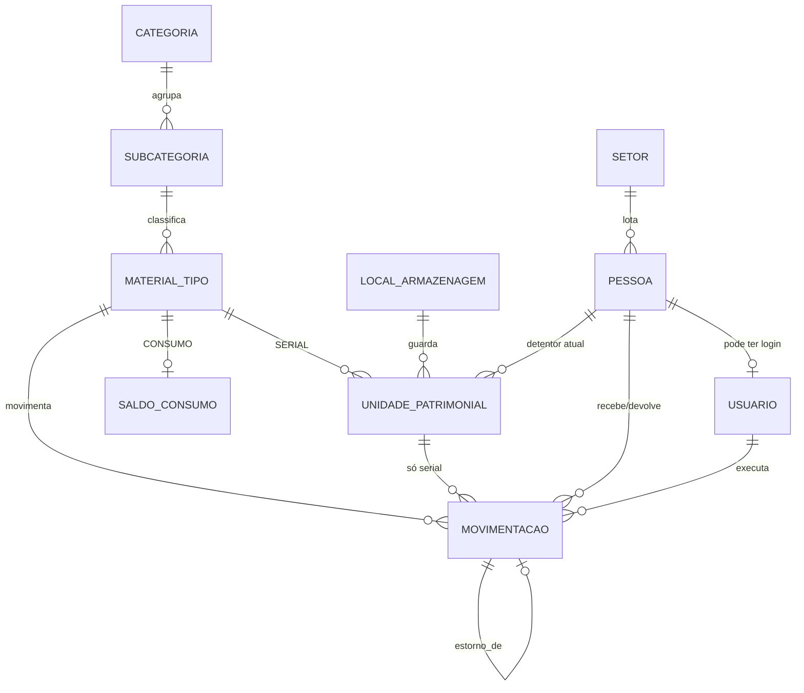

# Plano do projeto — Controle de Materiais e Cautela

> Documento da fase de planejamento. Descreve o que **será** construído; nada aqui é resultado medido. Os números dos padrões são parâmetros do gerador de dados, e cada um vira um teste antes de ser citado no README.

## 1. Problema

Uma unidade logística controla dois tipos de material:

- **Material permanente (patrimonial):** cada unidade tem um número de patrimônio próprio (BMP). Rádios, ferramentas, móveis e equipamentos saem por **cautela** (ficam sob responsabilidade de uma pessoa) e depois são devolvidos.
- **Material de consumo:** não tem número de patrimônio; é controlado por quantidade (papel, toner, material de limpeza).

Na prática, esse controle costuma viver em planilhas. A carga patrimonial passa por conferências periódicas que revelam problemas recorrentes: o mesmo item escrito de várias formas, números de série repetidos, itens sem patrimônio, local registrado de maneiras diferentes, itens marcados para baixa que continuam em uso e itens que não são encontrados.

O projeto transforma esse processo em um problema de dados: **quem está com o quê, o que está atrasado, o que sobra, o que falta, o que vai acabar e onde a carga não bate.**

## 2. Contexto e confidencialidade

O domínio vem da minha experiência em funções administrativas e de controle de material na Força Aérea Brasileira. **O sistema e todos os dados são fictícios**, gerados em Python:

- nenhum nome de pessoa, unidade, local, número de patrimônio ou número de série real;
- nenhuma informação operacional ou de segurança;
- nenhum armamento, munição ou material de armaria;
- documentos reais usados como referência de estrutura ficam fora do repositório (`data/raw/`, ignorado pelo git).

## 3. Decisões de escopo

| Tema | Decisão |
|---|---|
| Identidade | Projeto de **Dados primeiro**. A aplicação (API + tela do equipamentista) é uma fase posterior, que só começa com a análise publicada. |
| Modelo | **Híbrido:** unidades patrimoniais serializadas + saldo de consumo, com catálogo comum. |
| Perguntas de negócio | Conferência da carga; cautela e atrasos; uso e ociosidade; consumo e ruptura. |
| Regra de corte | Uma análise por vez, com teto de horas. O que não couber vira "próximos passos". |
| Volume | ~390 unidades patrimoniais, ~50 tipos de material, 40 pessoas, 12 meses, ~20 mil movimentações. |
| Banco | PostgreSQL 16 em Docker, banco próprio `almoxarifado` e usuário próprio. |
| Dashboard administrativo | Power BI, alimentado por views do banco. |
| Qualidade de dados | Checagens automáticas de data quality entram na Fase 2 (análise de conferência). |
| Fora do escopo | Pipeline ETL e Data Warehouse ficam para um projeto próprio de engenharia de dados, que poderá usar este banco como fonte. |

## 4. Modelo de dados

O banco tem dois schemas:

- **`staging`:** a planilha "suja" importada como texto, sem restrições. É o ponto de partida da análise de conferência.
- **`core`:** os dados limpos, com a integridade garantida pelo próprio banco.

> Implementado nas migrações `0001` a `0004`. As decisões e seus motivos estão em [DECISOES.md](DECISOES.md); os pontos em que a implementação diferiu do planejamento inicial estão marcados abaixo.

### Tabelas do `core`

| Tabela | Campos principais | Regras no banco |
|---|---|---|
| `categoria`, `subcategoria` | nome (subcategoria aponta para a categoria) | Duas tabelas (mudou: planejado como autorreferência); nome único sem diferenciar maiúsculas |
| `material_tipo` | código (fictício), nome, descrição, subcategoria, unidade de medida, `controle` (`SERIAL`/`CONSUMO`), prazo padrão de devolução **em horas**, custo unitário (fictício), ativo | `UNIQUE (codigo)`; `UNIQUE (id, controle)` para as FKs compostas; prazo só para serial; serial medido em `UN` |
| `setor`, `local_armazenagem` | sigla/nome | Nome único; locais genéricos |
| `pessoa` | nome e matrícula fictícios, setor, `data_entrada`, `data_saida` | `UNIQUE (matricula)`; quem recebe material não precisa ter login; `data_saida` = transferência (mudou: planejado como "ativo") |
| `usuario` | pessoa, login, perfil, ativo | Perfil restrito a 4 valores; `UNIQUE (pessoa_id)`; hash de senha entra na fase da aplicação |
| `unidade_patrimonial` | BMP, número de série, tipo, local, status, detentor atual | Ver abaixo |
| `saldo_consumo` | tipo, quantidade, mínimo, máximo | `CHECK (quantidade >= 0)`; `CHECK (maximo >= minimo)` |
| `movimentacao` | ver seção 4.2 | Somente inserção |

**`unidade_patrimonial`:**
- O BMP é único por unidade. Falta se, e somente se, o material recém-adquirido aguarda tombamento: `CHECK ((bmp IS NULL) = (status = 'AGUARDANDO_TOMBAMENTO'))`.
- Índice único parcial em `(material_tipo_id, numero_serie)` quando o número de série existe.
- `CHECK`: status `CAUTELADA` se e somente se há detentor.
- Status: `DISPONIVEL`, `CAUTELADA`, `EM_MANUTENCAO`, `NAO_LOCALIZADA`, `BAIXA_PENDENTE`, `BAIXADA`, `AGUARDANDO_TOMBAMENTO`.

**Chaves estrangeiras compostas:** `unidade_patrimonial` referencia `(material_tipo_id, 'SERIAL')` e `saldo_consumo` referencia `(material_tipo_id, 'CONSUMO')`. Assim, o banco impede criar saldo para um item patrimonial ou uma unidade para um item de consumo.

### 4.2 `movimentacao` (o histórico)

- Campos: `ocorrida_em` e `lancada_em` (`TIMESTAMPTZ`), tipo (`ENTRADA`, `RETIRADA`, `DEVOLUCAO`, `MUDANCA_STATUS`, `AJUSTE`, `ESTORNO`), tipo de material, unidade e status anterior/novo (só patrimonial), variação assinada e saldo antes/depois (só consumo), pessoa que recebe ou devolve, usuário que executou, setor de destino, finalidade, documento de referência, estado na devolução, prazo de devolução, observação e `estorno_de_id`. (Mudou: baixa e conferência viraram `MUDANCA_STATUS`.)
- `CHECK` de forma: ou é patrimonial (unidade e status novo preenchidos, sem saldo), ou é consumo (sem unidade, com `saldo_depois = saldo_antes + variacao`).
- **Nada é editado ou apagado.** Um erro é corrigido com uma movimentação de estorno que aponta para a original. Triggers bloqueiam `UPDATE`, `DELETE` e `TRUNCATE`; na fase da aplicação, o usuário da API também não terá essas permissões.
- **Toda movimentação passa por uma função do banco** (`core.registrar_*`, `core.alterar_status_unidade`, `core.estornar_movimentacao`), que confere o perfil, trava a linha, valida a regra e grava tudo numa transação. (Mudou: a regra no banco não estava no planejamento; ver D1.)
- A cautela não tem tabela própria: o par retirada/devolução é reconstruído com window functions (`LAG`/`LEAD`), de onde saem o tempo de posse e os atrasos.
- O estado atual (status e detentor da unidade, saldo de consumo) é atualizado **na mesma transação** que grava a movimentação, com a linha bloqueada (`SELECT ... FOR UPDATE`). Um teste garante que o estado atual é igual ao que o histórico reconstrói.

### 4.3 Regras de status do consumo

| Status | Regra |
|---|---|
| Sem estoque | quantidade = 0 |
| Crítico | quantidade ≤ 50% do mínimo |
| Baixo | quantidade ≤ mínimo |
| Normal | quantidade > mínimo |
| Inativo | tipo desativado |

Calculado por view, nunca gravado.

### 4.4 Views para o Power BI

`vw_com_quem_esta` (pessoa → materiais e material → pessoas), `vw_status_consumo`, `vw_cautelas_abertas`, `vw_cautelas_atrasadas`, `vw_giro_uso`.

### 4.5 Fora do schema por enquanto

Auditoria de edição de cadastro (JSONB antes/depois por trigger), sessões e permissões finas entram na fase da aplicação. Índices além dos essenciais só depois de medir com `EXPLAIN`.

## 5. Padrões do gerador de dados

Regras gerais: semente fixa, data-âncora (`--ate 2026-08-31`, período de 12 meses; mudou de 30/09 porque o banco recusa movimentações no futuro), todos os parâmetros em um único arquivo de configuração, e cada padrão com um teste que confirma que ele aparece nos dados gerados. Todo padrão tem ruído.

### Cautela e atrasos

| ID | Padrão |
|---|---|
| P1 | Rádios saem no início do turno e voltam no fim; ~90% no mesmo dia, ~5% no dia seguinte. |
| P2 | Perfis de pessoas: ~28 pontuais, ~8 ocasionais (~15% das cautelas em atraso) e 4 reincidentes (~40% em atraso). |
| P3 | Um setor concentra os atrasos de ferramentas elétricas (prazo padrão de 7 dias). |
| P4 | Três unidades ficam cauteladas com pessoas que depois são transferidas da unidade; mais de 60 dias depois, a conferência as marca como `NAO_LOCALIZADA`. |

### Uso e ociosidade

| ID | Padrão |
|---|---|
| P5 | ~20% dos tipos respondem por ~80% das retiradas (curva ABC nítida). |
| P6 | ~25% dos tipos cauteláveis sem uso no ano; um tipo com 10 unidades usa só 3 (sobra). |
| P7 | Dois tipos com poucas unidades têm picos em que todas estão cauteladas ao mesmo tempo (falta). |

### Consumo e ruptura

| ID | Padrão |
|---|---|
| P8 | Demanda diária com sazonalidade por categoria e sem movimento nos fins de semana. |
| P9 | 17 tipos bem calibrados (a maioria sem nenhuma falta no ano), 4 com ruptura recorrente (3 mal calibrados + 1 com fornecedor lento) e 3 com excesso persistente (compra de mais de um ano de demanda). |
| P10 | Três tipos com estoque mínimo mal calibrado de propósito (menor que a demanda durante o prazo de reposição): 5 a 7 episódios de falta no ano, medido em 5 sementes. |
| P11 | Entradas em lotes de compra, com prazo de reposição variável: 7 a 21 dias, e 25 a 45 no fornecedor lento. A data do pedido vai na observação da entrada, como numa nota de empenho, para a análise medir o prazo. |

A análise deve encontrar P10 comparando o mínimo cadastrado com o ponto de reposição calculado (`d·L + z·σ·√L`).

### Conferência (planilha suja com gabarito)

O gerador cria a carga limpa e depois injeta erros, guardando um gabarito de cada um. Assim, a limpeza pode ser medida por precisão e revocação.

| ID | Erro injetado | Taxa |
|---|---|---|
| P12 | Variação de nomenclatura do mesmo tipo (caixa, acento, hífen, ordem das palavras) | ~25% das linhas |
| P13 | Erro de digitação de um caractere; artefatos de extração de texto | ~4% / ~2% |
| P14 | BMP ausente (metade legítima, metade erro); BMP com dígito trocado | ~3% / ~1% |
| P15 | Número de série ou etiqueta repetidos em unidades diferentes; linhas duplicadas | ~1,5% / ~1% / ~0,5% |
| P16 | Local escrito de várias formas; baixa marcada com detentor ativo; divergência entre planilha e histórico | ~30% / ~1% / ~2% |

Um local concentra ~45% dos erros. As análises se conectam: as unidades não localizadas de P4 aparecem na conferência (P16), e a sobra (P6) e a falta (P7) formam a mesma leitura de remanejamento.

## 6. Tarefas

### Critério de pronto

Uma tarefa só está pronta quando foi implementada, executada, testada (incluindo entradas inválidas e casos extremos, não só o caminho feliz), corrigida, testada de novo, revisada e integrada ao resto. O que não puder ser verificado é registrado como não verificado, com o motivo.

- Ciclo por tarefa: planejar → implementar → testar → revisar → corrigir → testar de novo → documentar → commit pequeno (`feat:`, `fix:`, `test:`, `docs:`).
- Antes de fechar uma fase: lint → verificação de tipos → testes, tudo passando.
- Mudanças no banco só por migrations versionadas.
- Soluções provisórias só marcadas como `TODO / TECHNICAL DEBT`, com a solução correta descrita.
- Ao fim de cada fase, um checkpoint: implementado, testado, problemas encontrados e corrigidos, pendências.
- Antes de encerrar o projeto: três revisões independentes (engenharia de software, QA e engenharia de dados).

As horas de cada tarefa abaixo são de implementação. O total de cada fase já inclui ~30% para testes, revisão e correção.

### Fase 0 — Planejamento (~2 h)

| # | Tarefa |
|---|---|
| T0.1 | Este documento |
| T0.2 | README com o status do projeto |
| T0.3 | `data/raw/` fora do git |

### Fase 1 — Dados (~43 h com revisão) — concluída em 24/09/2026

| # | Tarefa | h | Pronto quando |
|---|---|---|---|
| T1.1 | Banco `almoxarifado` e usuário próprio no container existente; fuso fixado; `.venv`, `requirements.txt`; ferramentas de qualidade (`ruff` para lint e formatação, `mypy` no código Python fora dos notebooks, `pytest`); ferramenta de migrations | 3 | Conecta pelo Python sem afetar o outro banco do container; lint, tipos e um teste vazio passam |
| T1.2 | DDL do `core`: tabelas, FKs compostas, `CHECK`s, índice parcial, trigger de imutabilidade | 6 | Sobe do zero sem erro |
| T1.3 | Testes do schema com `pytest`, em transação com `ROLLBACK` | 3 | Cada regra tem um teste que tenta quebrá-la |
| T1.4 | Schema `staging` | 1 | Criado |
| T1.5 | Gerador: catálogo, setores, locais, pessoas, unidades | 4 | Volumes da seção 3, só dados fictícios |
| T1.6 | Gerador: movimentações patrimoniais (P1–P7) com estado coerente | 6 | Nenhuma devolução sem retirada; nenhuma unidade cautelada duas vezes |
| T1.7 | Gerador: consumo (P8–P11) com saldo antes/depois | 4 | Saldo nunca negativo |
| T1.8 | Carga no banco; teste "estado atual = histórico"; hash de reprodutibilidade | 3 | Duas execuções produzem o mesmo hash |
| T1.9 | Planilha suja e gabarito (P12–P16) | 4 | Taxas observadas batem com a configuração |
| T1.10 | Testes dos padrões P1–P16 | 3 | Todos passam |

### Fase 2 — Análise (~74 h com revisão)

Teto de horas por análise; se estourar, o escopo é revisto.

| # | Tarefa | h | Pronto quando |
|---|---|---|---|
| A1 | Conferência: SQL no `staging` + notebook Pandas de limpeza, com precisão e revocação | 10 | Notebook roda do zero, com insights escritos — **concluída** (view SQL + notebook `01_conferencia`) |
| DQ | Checagens de data quality em SQL (material sem código, código duplicado, saldo negativo, movimentação sem usuário ou sem material, quantidade inválida, data inválida ou futura, referência inexistente), com cada ocorrência registrada em uma tabela de resultados | 3 | Cada checagem tem um teste que injeta o problema e confirma que ele é detectado — **concluída** (migração 0007, schema `dq`, 10 regras; ver D15) |
| A2 | Cautela e atrasos: `LAG`/`LEAD`, ranking por pessoa e setor, unidades não localizadas | 8 | Consultas em `sql/analises.sql`, com `EXPLAIN` nas principais |
| M1 | Publicação intermediária (schema, gerador, A1, A2, README parcial) | 3 | Repositório apresentável |
| A3 | Uso e ociosidade: taxa de utilização, curva ABC, sobra e falta | 8 | Idem A2 |
| A4 | Consumo e ruptura: ponto de reposição com NumPy × mínimo cadastrado | 10 | Os mínimos mal calibrados aparecem pela análise |
| V1 | Views para o Power BI | 3 | Power BI lê todas |
| PB | Relatório Power BI | 10 | Uma página por pergunta de negócio |
| R1 | README de case e prints | 5 | Toda afirmação foi conferida de novo |

### Fases 3 e 4 — Aplicação (depois da Fase 2 publicada)

API Node/TypeScript com SQL escrito à mão, transações e `FOR UPDATE`; login com perfis Administrador e Equipamentista; tela mobile do equipamentista (retirada e devolução em poucos toques). Detalhadas quando a Fase 2 estiver publicada.
