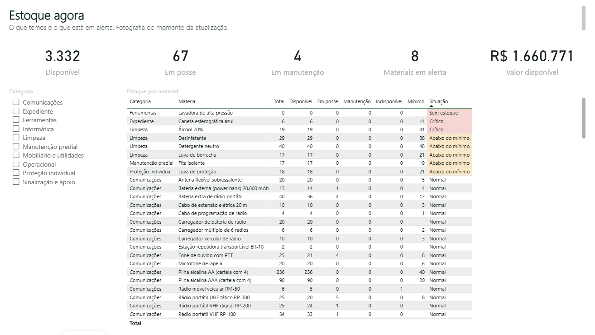
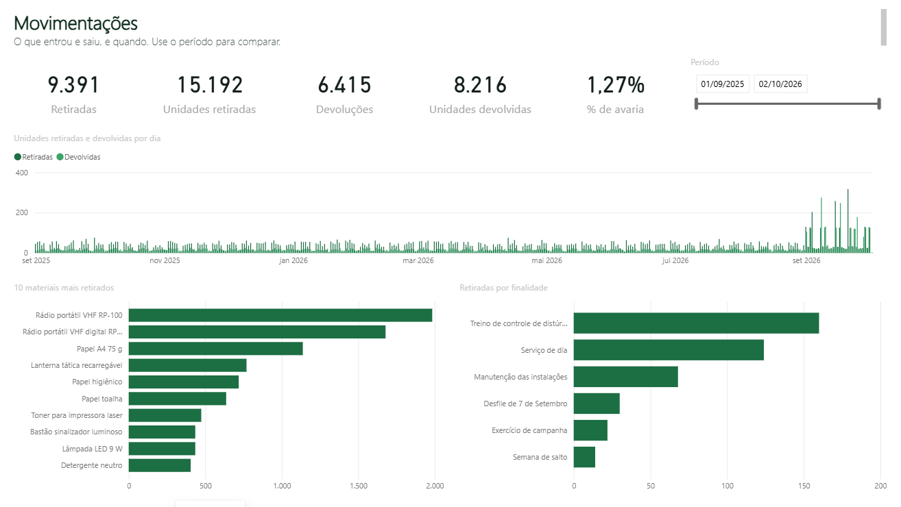

# Guia do Power BI

O banco já entrega os dados prontos para o Power BI no schema `bi` (modelo estrela). São dois relatórios, cada um lendo o banco que responde à sua pergunta:

| Relatório | Banco | Pergunta | Seção |
|---|---|---|---|
| **Operacional** | `almoxarifado_app` (o "sistema vivo") | O que entrou e saiu, com quem está, quem atendeu, o que está em manutenção? | [Parte A](#parte-a--relatório-operacional) |
| **Analítico** | `almoxarifado` (congelado em 31/08/2026) | Onde a planilha não bate, quem atrasa, o que sobra e o que falta? | [Parte B](#parte-b--relatório-analítico) |

O sistema web não tem gráficos de propósito: a tela é para operar (retirar, devolver, conferir). Análise e acompanhamento ficam no Power BI.

**O relatório operacional já está montado** em [`powerbi/relatorio_operacional.pbip`](../powerbi/), no formato de projeto do Power BI (PBIP): o modelo fica em texto (TMDL, uma tabela por arquivo, com as medidas e as descrições) e as páginas em JSON (PBIR, um arquivo por visual). Assim cada mudança no relatório aparece no `git diff` como qualquer código. Para abrir: Docker Desktop aberto, duplo clique no `.pbip`, **Atualizar agora** e as credenciais abaixo (só na primeira vez). O arquivo não guarda dados nem senha: os dados vêm do banco a cada atualização (o cache local `.pbi/` é ignorado pelo git).

<p align="center"> </p>

## Conexão (somente leitura, vale para os dois)

O Power BI conecta com um usuário **que só lê**: o `almox_bi` (nome e senha no `.env`, variáveis `ALMOX_BI_USER` e `ALMOX_BI_PASSWORD`). Ele enxerga os schemas `bi`, `analise` e `dq`. **Não** enxerga as tabelas do `core`, a auditoria, o `staging`, nem as senhas e sessões do schema `app`, e não consegue gravar nada: isso é testado em `tests/test_bi.py`.

No Power BI Desktop: **Obter dados → Banco de dados PostgreSQL**.

| Campo | Valor |
|---|---|
| Servidor | `127.0.0.1:5432` |
| Banco de dados | `almoxarifado_app` (operacional) ou `almoxarifado` (analítico) |
| Modo | **Importar** (os dados cabem com folga; o relatório fica rápido) |
| Credenciais | Banco de dados → usuário `almox_bi` e a senha do `.env` |

> Se o Power BI pedir, marque a opção para não usar criptografia na conexão local. O banco só aceita conexões desta máquina (porta publicada em `127.0.0.1`).

**Tema:** Exibir → Temas → Procurar temas → `docs/powerbi/tema-verde.json`. É a mesma identidade da tela (verde), com âmbar e vermelho só para atenção e problema.

---

## Parte A — Relatório operacional

### A.1 Tabelas a importar (schema `bi`)

| Tabela | Tipo | Chave | O que tem |
|---|---|---|---|
| `dim_calendario` | dimensão | `data` | um dia por linha, da primeira retirada (01/09/2025) até a última movimentação |
| `dim_material` | dimensão | `codigo` | nome, categoria, subcategoria, controle, prazo, valor, estoque mínimo |
| `dim_pessoa` | dimensão | `matricula` | militar: posto/graduação, nome de guerra, setor, entrada e saída |
| `dim_setor` | dimensão | `sigla` | nome do setor |
| `dim_operador` | dimensão | `login` | quem opera o balcão: perfil, posto, nome de guerra (`operador` = "SGT ENZO") |
| `fato_movimentacao` | fato | `id` | cada movimento: tipo, material, BMP, militar, quem executou, quantidade, operação, estados, finalidade, hora |
| `fato_posse_atual` | fato | `bmp` | cada unidade com um militar agora: retirada, prazo, vencida, horas em posse e de atraso, quem entregou |
| `fato_estoque_atual` | fato | `material` | total, disponível, em posse, manutenção, indisponível, mínimo, situação, valor disponível |
| `fato_unidade_atual` | fato | `bmp` | cada unidade: situação, local, com quem está, desde quando e há quantos dias |

### A.2 Relacionamentos

Em **Exibição de modelo**, ligue as dimensões aos fatos (um para muitos, filtro em direção única, da dimensão para o fato):

| Dimensão (lado 1) | Fato (lado muitos) |
|---|---|
| `dim_calendario[data]` | `fato_movimentacao[data]`, `fato_posse_atual[data_retirada]` |
| `dim_material[codigo]` | `fato_movimentacao[material]`, `fato_posse_atual[material]`, `fato_estoque_atual[material]`, `fato_unidade_atual[material]` |
| `dim_pessoa[matricula]` | `fato_movimentacao[pessoa]`, `fato_posse_atual[pessoa]`, `fato_unidade_atual[pessoa]` |
| `dim_operador[login]` | `fato_movimentacao[executado_por]`, `fato_posse_atual[entregue_por]` |
| `dim_setor[sigla]` | `dim_pessoa[setor]` |

Marque `dim_calendario` como **tabela de datas** (botão direito → Marcar como tabela de datas → coluna `data`).

**Por que três fatos "atuais" e não um só:** cada um tem um grão diferente. `fato_posse_atual` é uma linha por unidade em posse, `fato_estoque_atual` uma por material e `fato_unidade_atual` uma por unidade cadastrada. Misturar grãos numa tabela faz as somas contarem a mesma coisa duas vezes.

**Por que "operação":** uma retirada de 3 escudos grava 3 linhas (uma por BMP) com o mesmo código de operação. Para contar **atendimentos** use `DISTINCTCOUNT(operacao)`; para contar **unidades**, some `quantidade`.

### A.3 Medidas (DAX)

Crie uma tabela vazia `Medidas` (Inserir → Inserir dados → OK) para guardar as medidas num só lugar.

```dax
Retiradas = CALCULATE ( DISTINCTCOUNT ( fato_movimentacao[operacao] ), fato_movimentacao[tipo] = "RETIRADA" )
```
Atendimentos de retirada no filtro da página. `DISTINCTCOUNT` conta cada operação uma vez, mesmo que ela tenha várias unidades.

```dax
Unidades retiradas = CALCULATE ( SUM ( fato_movimentacao[quantidade] ), fato_movimentacao[tipo] = "RETIRADA" )
Devoluções = CALCULATE ( DISTINCTCOUNT ( fato_movimentacao[operacao] ), fato_movimentacao[tipo] = "DEVOLUCAO" )
Unidades devolvidas = CALCULATE ( SUM ( fato_movimentacao[quantidade] ), fato_movimentacao[tipo] = "DEVOLUCAO" )
Entradas (unidades) = CALCULATE ( SUM ( fato_movimentacao[quantidade] ), fato_movimentacao[tipo] = "ENTRADA" )
```
O mesmo padrão: `CALCULATE` troca o filtro do tipo e mantém os outros (mês, material, setor).

```dax
Devolvidas com avaria =
CALCULATE (
    COUNTROWS ( fato_movimentacao ),
    fato_movimentacao[estado_devolucao] IN { "AVARIADO", "INSERVIVEL" }
)

% de avaria = DIVIDE ( [Devolvidas com avaria], [Unidades devolvidas] )
```
`IN { ... }` é a lista de valores aceitos. `DIVIDE` devolve vazio (e não erro) quando não há devolução no filtro.

```dax
Em posse agora = COUNTROWS ( fato_posse_atual )
Posse vencida = CALCULATE ( COUNTROWS ( fato_posse_atual ), fato_posse_atual[vencida] = TRUE () )
Militares com material = DISTINCTCOUNT ( fato_posse_atual[pessoa] )
Atraso médio (h) = CALCULATE ( AVERAGE ( fato_posse_atual[horas_de_atraso] ), fato_posse_atual[vencida] = TRUE () )
```

```dax
Disponível = SUM ( fato_estoque_atual[disponivel] )
Em manutenção = SUM ( fato_estoque_atual[em_manutencao] )
Materiais em alerta = CALCULATE ( COUNTROWS ( fato_estoque_atual ), fato_estoque_atual[em_alerta] = TRUE () )
Valor disponível = SUM ( fato_estoque_atual[valor_disponivel] )
Dias médios em manutenção =
CALCULATE ( AVERAGE ( fato_unidade_atual[dias_na_situacao] ), fato_unidade_atual[status] = "EM_MANUTENCAO" )
```
As medidas "atuais" são uma fotografia de agora: não use `dim_calendario` como filtro nelas (a data da foto é a de hoje).

O relatório pronto tem mais três medidas, e duas delas nasceram de erros que a verificação encontrou:

```dax
Retiradas por finalidade = CALCULATE ( [Retiradas], KEEPFILTERS ( NOT ISBLANK ( fato_movimentacao[finalidade] ) ) )
```
Sem `KEEPFILTERS`, a condição sobre `finalidade` **substitui** o filtro que cada barra do gráfico põe na mesma coluna, e todas as barras mostravam o total. Com `KEEPFILTERS`, ela é **somada** ao filtro da barra: cada finalidade mostra a sua contagem e o histórico antigo (sem finalidade) some do gráfico.

```dax
Unidades retiradas (top 10 materiais) =
IF ( RANKX ( ALLSELECTED ( dim_material[nome] ), [Unidades retiradas] ) <= 10, [Unidades retiradas] )

Unidades retiradas (top 15 militares) =
IF ( RANKX ( ALLSELECTED ( dim_pessoa[militar], dim_pessoa[posto_ordem] ), [Unidades retiradas] ) <= 15, [Unidades retiradas] )
```
`RANKX` dá a posição de cada item entre os que estão no filtro; fora do top, a medida devolve vazio e a barra não aparece. Dois cuidados: (1) a coluna `militar` é ordenada por `posto_ordem` ("Ordenar por coluna"), e o Power BI agrupa pelas duas; sem `posto_ordem` no `ALLSELECTED`, o ranking era feito **dentro de cada posto** e o "top 15" mostrava mais de 15; (2) empate: com `Dense`, dois materiais empatados com 435 unidades ocupavam a mesma posição e entravam 11; o padrão (`Skip`) pula a posição seguinte.

`Cor da situação` devolve a cor de fundo da coluna Situação (formatação condicional pelo valor do campo), e as colunas calculadas `situacao_texto` e `gravidade` deixam a situação legível e ordenada do mais grave para o normal.

### A.4 Páginas sugeridas

| Página | Pergunta | Visuais |
|---|---|---|
| **Estoque agora** | O que temos e o que está em alerta? | cartões: `Disponível`, `Em posse agora`, `Em manutenção`, `Materiais em alerta`, `Valor disponível`; matriz categoria → material com total, disponível, em posse, manutenção, mínimo e `situacao` (formatação condicional: vermelho para `SEM_ESTOQUE`/`CRITICO`, âmbar para `ABAIXO_DO_MINIMO`); segmentação por categoria |
| **Movimentações** | O que entrou e saiu, e quando? | colunas por dia com `Unidades retiradas` e `Unidades devolvidas` (`dim_calendario[data]`); barras dos 10 materiais mais retirados (filtro Top N por `Unidades retiradas`); barras de `Retiradas` por `fato_movimentacao[finalidade]`; segmentação de período |
| **Posse e prazos** | Com quem está o material e quem está atrasado? | tabela de `fato_posse_atual` com `dim_pessoa[posto_graduacao]`, `dim_pessoa[nome_guerra]`, `dim_material[nome]`, `retirada_em`, `prazo`, `horas_de_atraso` e `dim_operador[operador]` (quem entregou), ordenada por atraso; barras de `Posse vencida` por setor |
| **Equipamentistas** | Quem atende e em que horário? | barras agrupadas de `Retiradas` e `Devoluções` por `dim_operador[operador]`; matriz `operador` × `fato_movimentacao[hora]` com `Retiradas` (mapa de calor: o pico do balcão) |
| **Militares** | Quem mais retira e quem mais atrasa? | barras de `Unidades retiradas` por militar (posto + nome de guerra); tabela de `Posse vencida` por militar |
| **Manutenção** | O que está parado e por quê? | tabela de `fato_unidade_atual` filtrada em `EM_MANUTENCAO`, `BAIXA_PENDENTE` e `NAO_LOCALIZADA`, com `dias_na_situacao`; barras de `% de avaria` por subcategoria |

### A.5 Números de referência (setembro de 2026)

Para conferir se o relatório está certo. São fixos porque a atividade de setembro é gerada com semente fixa (`almox.atividade`). Mudam assim que alguém usar o sistema; para voltar a eles, recarregue o banco da aplicação (`python -m almox.carga --recriar --banco app`).

| Medida (filtro: 01/09 a 30/09/2026) | Valor |
|---|---|
| `Retiradas` / `Unidades retiradas` | 395 / 2.277 |
| `Devoluções` / `Unidades devolvidas` | 410 / 2.112 |
| `Entradas (unidades)` | 2.402 (1.723 movimentos: a incorporação de 01/09, um lote de coletes e reposições de consumo) |
| `Devolvidas com avaria` / `% de avaria` | 23 / 1,09% |
| Retiradas por finalidade | treino de choque 144, serviço de dia 120, manutenção das instalações 65, desfile 30, campanha 22, salto 14 |
| Retiradas / devoluções por equipamentista | SGT ENZO 124 / 143, SGT MATEUS 109 / 103, CB GUERRA 88 / 80, CB PAULO 74 / 84 |
| Horário de pico (atendimentos) | 7h (191), 13h (144), 17h (137) |

| Medida atual (logo depois de recarregar) | Valor |
|---|---|
| `Em posse agora` / `Militares com material` | 68 / 17 |
| Unidades por situação (`fato_unidade_atual`) | disponível 1.986, em posse 68, baixada 28, baixa pendente 8, em manutenção 4, não localizada 4, sem tombamento 3 |
| `Materiais em alerta` / `Valor disponível` | 8 / R$ 1.660.321,00 |

`Posse vencida` depende do relógio: as posses do serviço de 01/10 vencem em 02/10 de manhã.

---

## Parte B — Relatório analítico

Banco `almoxarifado` (congelado em 31/08/2026, o mesmo dos notebooks).

### B.1 Tabelas a importar

**Modelo estrela** (schema `bi`):

| Tabela | Tipo | Chave | O que tem |
|---|---|---|---|
| `bi.dim_calendario` | dimensão | `data` | um dia por linha nos 12 meses: ano, mês, trimestre, dia útil |
| `bi.dim_material` | dimensão | `codigo` | catálogo: nome, categoria, subcategoria, controle, custo |
| `bi.dim_pessoa` | dimensão | `matricula` | nome, setor, datas de entrada e saída, posto e nome de guerra |
| `bi.dim_setor` | dimensão | `sigla` | nome do setor |
| `bi.fato_movimentacao` | fato | `id` | cada movimentação do histórico (15,7 mil) |
| `bi.fato_cautela` | fato | `retirada_id` | cada cautela: prazo, devolução, atraso |
| `bi.fato_consumo_diario` | fato | `data` + `material` | saída e saldo de cada material de consumo por dia |

**Tabelas de apoio** (já agregadas; úteis para cartões e tabelas):
`analise.vw_uso_material` (A3), `analise.vw_status_consumo` (situação atual), `analise.vw_ruptura` (episódios de falta), `analise.vw_atraso_pessoa` (A2), `analise.vw_conferencia_planilha` (A1), `dq.vw_ultima_execucao` (qualidade de dados).

### B.2 Relacionamentos

| Dimensão (lado 1) | Fato (lado muitos) |
|---|---|
| `dim_calendario[data]` | `fato_movimentacao[data]` |
| `dim_calendario[data]` | `fato_cautela[data_retirada]` |
| `dim_calendario[data]` | `fato_consumo_diario[data]` |
| `dim_material[codigo]` | `fato_movimentacao[material]`, `fato_cautela[material]`, `fato_consumo_diario[material]` |
| `dim_pessoa[matricula]` | `fato_movimentacao[pessoa]`, `fato_cautela[pessoa]` |
| `dim_setor[sigla]` | `dim_pessoa[setor]` |

**Por que modelo estrela:** cada fato guarda só códigos e números; os textos (nome do material, setor) ficam nas dimensões. O filtro escolhido numa dimensão (um setor, um mês) passa para todos os fatos ligados a ela, e o modelo fica menor e mais rápido.

### B.3 Medidas (DAX)

```dax
Cautelas = COUNTROWS ( fato_cautela )
```
Conta as linhas da tabela de cautelas **no contexto do filtro** (mês, setor, material...). É a base das outras.

```dax
Cautelas atrasadas = CALCULATE ( [Cautelas], fato_cautela[atrasada] = TRUE () )
```
`CALCULATE` muda o filtro: conta só as linhas com `atrasada` verdadeiro, mantendo os outros filtros da página.

```dax
% de atraso = DIVIDE ( [Cautelas atrasadas], [Cautelas] )
```
`DIVIDE` em vez de `/`: se não houver cautelas no filtro, devolve vazio em vez de erro de divisão por zero.

```dax
Rádios devolvidos no mesmo dia =
DIVIDE (
    CALCULATE ( [Cautelas], fato_cautela[mesmo_dia] = TRUE (),
                dim_material[subcategoria] = "Rádios portáteis" ),
    CALCULATE ( [Cautelas], fato_cautela[situacao] = "DEVOLVIDA",
                dim_material[subcategoria] = "Rádios portáteis" )
)
```
Dois filtros no mesmo `CALCULATE` se combinam com "E". O filtro em `dim_material` chega ao fato pelo relacionamento.

```dax
Dias com falta = CALCULATE ( COUNTROWS ( fato_consumo_diario ), fato_consumo_diario[zerado] = TRUE () )
```
Cada linha do fato de consumo é um material em um dia: contar as linhas zeradas dá "dias com falta".

```dax
Saldo no fim do período =
CALCULATE (
    SUM ( fato_consumo_diario[saldo_fim_do_dia] ),
    LASTDATE ( dim_calendario[data] )
)
```
Saldo **não se soma no tempo** (somar o saldo de 30 dias não faz sentido). `LASTDATE` pega só o último dia do filtro: num gráfico por mês, mostra o saldo do fim de cada mês. Isso é o que se chama de medida semiaditiva.

```dax
Valor parado = SUM ( 'analise vw_uso_material'[valor_parado] )
```
(O nome da tabela depende de como o Power BI a nomear na importação.)

### B.4 Páginas sugeridas (uma por pergunta)

| Página | Pergunta | Visuais sugeridos |
|---|---|---|
| Visão geral | Como está o almoxarifado hoje? | cartões: cautelas no ano, % de atraso, itens de consumo críticos (`vw_status_consumo`), ocorrências de qualidade (`dq.vw_ultima_execucao`) |
| A1 Conferência | Onde a planilha não bate? | barras por tipo de problema e por local (`vw_conferencia_planilha`); tabela das divergências com o histórico |
| A2 Cautela e atrasos | Quem atrasa e onde? | % de atraso por subcategoria e setor (matriz); tabela das cautelas vencidas em aberto (`fato_cautela`, `situacao = EM_ABERTO`, `atrasada`) |
| A3 Uso e ociosidade | O que sobra e o que falta? | barras de valor parado e de horas esgotado (`vw_uso_material`); segmentação pela classe ABC |
| A4 Consumo e ruptura | O que vai faltar? | linha do saldo por dia com segmentação de material (`fato_consumo_diario`); tabela de episódios (`vw_ruptura`); status atual |

Os notebooks (`notebooks/0*.ipynb`) têm os números de referência para conferir se o relatório está certo: por exemplo, 5.994 cautelas no ano, 11,8% com atraso e 56 dias sem toner.

---

## Verificação e atualização

> **Parte A verificada no Power BI Desktop (2.158, set/2026):** o projeto `powerbi/relatorio_operacional.pbip` foi aberto, atualizado contra o `almoxarifado_app` e cada cartão conferido com SQL equivalente no banco (disponível, valor, retiradas, unidades, devoluções, % de avaria, posse vencida, dias em manutenção, retiradas por finalidade e o top 10). **Parte B ainda não verificada no Power BI:** as medidas seguem a sintaxe padrão do DAX e os números de referência foram calculados com SQL; confira cada medida com eles.

Os dados são fictícios e reproduzíveis. Se o banco for recarregado (`python -m almox.carga --recriar` ou `--banco app`), basta **Atualizar** no Power BI. Como o usuário do BI e as permissões são recriados pelo bootstrap e pelas migrações, a conexão continua funcionando.
